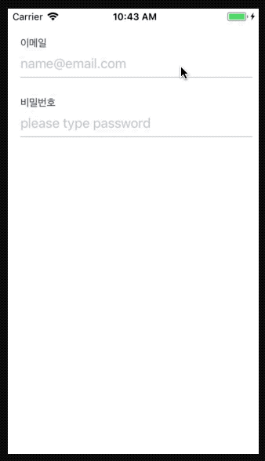

# MaterialLikeTextField

[](https://travis-ci.org/brownsoo/MaterialLikeTextField)
[](https://cocoapods.org/pods/MaterialLikeTextField)
[](https://cocoapods.org/pods/MaterialLikeTextField)
[](https://cocoapods.org/pods/MaterialLikeTextField)

### MaterialTextField is material design styled text field, extends UITextField class.



### TODO

- [ ] Code line documentation
- [ ] fix: 'changeLabelWithPlaceholder' is set to use it.
- [ ] add more examples

## Example

To run the example project, clone the repo, and run `pod install` from the Example directory first.

## Requirements

## Installation

MaterialLikeTextField is available through [CocoaPods](https://cocoapods.org). To install
it, simply add the following line to your Podfile:

```ruby
pod 'MaterialLikeTextField'
```

## Author

brownsoo, hansune@me.com

## License

MaterialLikeTextField is available under the MIT license. See the LICENSE file for more info.
